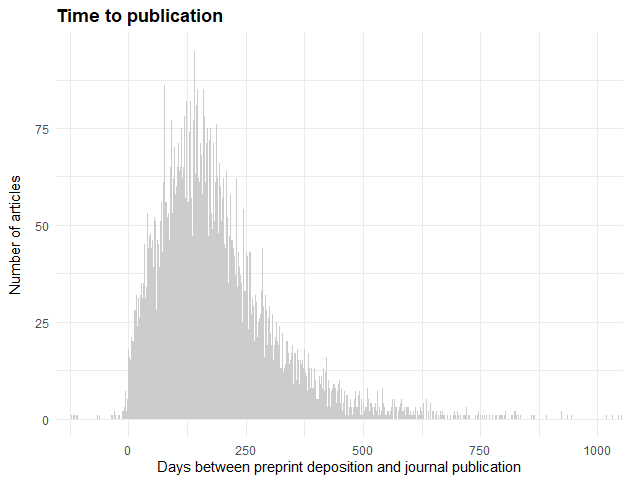

<!-- README.md is generated from README.Rmd. Please edit that file -->

# rbiorxiv

R client for interacting with the [bioRxiv API](https://api.biorxiv.org)

## Installation

Install from CRAN:

``` r
# Install package
install.packages("rbiorxiv")

# Load package
library(rbiorxiv)
```

Or install the development version from Github (using the
[devtools](https://cran.r-project.org/web/packages/devtools/index.html)
package):

``` r
# Install package
install.packages("devtools")
devtools::install_github("nicholasmfraser/rbiorxiv")

# Load package
library(rbiorxiv)
```

## Usage

The main functions in `rbiorxiv` generally conform to the API endpoints
outlined in the API documentation ([see
here](https://api.biorxiv.org/)).

### Content detail

Retrieve details of either a set of preprints deposited between two
dates, or lookup a single preprint by DOI:

``` r
# Get details of preprints deposited between 2018-01-01 and 2018-01-10
# By default, only the first 100 records are returned
biorxiv_content(from = "2018-01-01", to = "2018-01-10")

# Set a limit to return more than 100 records
biorxiv_content(from = "2018-01-01", to = "2018-01-10", limit = 200)

# Or set limit as "*" to return all records
biorxiv_content(from = "2018-01-01", to = "2018-01-10", limit = "*")

# Skip the first 100 records
biorxiv_content(from = "2018-01-01", to = "2018-01-10", limit = 200, skip = 100)

# By default, data is returned in a list. Use the "format" argument to specify
# that data should be returned in "json" format or as a data frame ("df").
biorxiv_content(from = "2018-01-01", to = "2018-01-10", format = "df")

# Lookup a preprint by DOI
biorxiv_content(doi = "10.1101/833400")
```

The bioRxiv API also allows querying of details of
[medRxiv](https://www.medrxiv.org/) preprints, by supplying a “server”
parameter. This can be specified as follows:

``` r
# Get details of medRxiv preprints deposited between 2020-01-01 and 2020-01-02
biorxiv_content(server = "medrxiv", from = "2020-01-01", to = "2020-01-02")
```

The default server parameter is always “biorxiv”. Note that the
following functions documented below are limited to bioRxiv only (at the
time of writing).

### Published article detail

Retrieve details of published articles associated with bioRxiv preprints
that were published between two dates:

``` r
# Get details of all articles published between 2018-01-01 and 2018-01-10
biorxiv_published(from = "2018-01-01", to = "2018-01-10", limit = "*", format = "df")
```

### Publisher article detail

Retrieve details of articles published by a specific publisher
(specified by their doi prefix) between two dates:

``` r
# Get details of all articles published by eLife (prefix = 10.7554) between 2018-01-01 and 2018-01-10
biorxiv_publisher(prefix = "10.7554", from = "2018-01-01", to = "2018-01-10", 
                   limit = "*", format = "df")
```

### Content summary statistics

Retrieve summary statistics for bioRxiv content (e.g. number of
preprints deposited):

``` r
# Get summary statistics at a montly level
biorxiv_summary(interval = "m")

# Get summary statistics at a yearly level
biorxiv_summary(interval = "y")
```

### Usage summary statistics

Retrieve summary statistics for usage of bioRxiv content (e.g. number of
pdf downloads):

``` r
# Get usage statistics at a montly level
biorxiv_usage(interval = "m")

# Get usage statistics at a yearly level
biorxiv_usage(interval = "y")
```

## Examples

### Growth of bioRxiv over time

``` r
library(tidyverse)

# Plot the cumulative number of new preprints deposited per month
# Note that month dates are returned in YYYY-MM format - here we convert
# month dates to YYYY-MM-DD format to make plotting easier
biorxiv_summary(interval = "m", format = "df") %>%
  mutate(month = as.Date(paste0(month, "-01"), format = "%Y-%m-%d")) %>%
  ggplot() +
  geom_bar(aes(x = month, y = new_papers_cumulative),
           fill = "#cccccc",
           stat = "identity") +
  labs(x = "",
       y= "Submissions",
       title ="Cumulative new bioRxiv submissions") +
  scale_x_date(date_breaks = "3 months",
               date_minor_breaks = "3 months",
               date_labels = "%b-%y",
               expand = c(0,0)) +
  scale_y_continuous(labels = scales::comma) +
  theme_minimal() +
  theme(
    axis.text.x = element_text(angle = 90, vjust = 0.5),
    axis.title.y = element_text(margin = margin(t = 0, r = 10, b = 0, l = 0)),
    plot.title = element_text(face = "bold")
  )
```


### PDF downloads over time

``` r
library(tidyverse)

# Plot the cumulative number of PDF downloads per month
# Here month dates are returned already in YYYY-MM-DD format
biorxiv_usage(interval = "m", format = "df") %>%
  mutate(month = as.Date(month)) %>%
  ggplot() +
  geom_bar(aes(x = month, y = pdf_cumulative),
           fill = "#cccccc",
           stat = "identity") +
  labs(x = "",
       y= "PDF downloads (cumulative)",
       title ="Number of bioRxiv PDF downloads over time") +
  scale_x_date(date_breaks = "3 months",
               date_minor_breaks = "3 months",
               date_labels = "%b-%y",
               expand = c(0,0)) +
  scale_y_continuous(labels = scales::comma) +
  theme_minimal() +
  theme(
    axis.text.x = element_text(angle = 90, vjust = 0.5),
    axis.title.y = element_text(margin = margin(t = 0, r = 10, b = 0, l = 0)),
    plot.title = element_text(face = "bold")
  )
```


### Time to publication

``` r
library(tidyverse)

# Calculate the number of days between preprint deposition and 
# journal publication. Plot results as a histogram.
biorxiv_published(from = "2013-11-01", to = "2018-12-31", 
                  limit = "*", format = "df") %>%
  mutate(days = as.Date(published_date) - as.Date(preprint_date)) %>%
  ggplot() +
  geom_histogram(aes(as.numeric(days)),
                 binwidth = 1,
                 fill = "#cccccc") +
  labs(x = "Days between preprint deposition and journal publication",
       y= "Number of articles",
       title ="Time to publication") +
  coord_cartesian(xlim = c(-100, 1000)) +
  theme_minimal() +
  theme(
    axis.title.y = element_text(margin = margin(t = 0, r = 10, b = 0, l = 0)),
    plot.title = element_text(face = "bold")
  )
```



## Other tools/packages for working medRxiv/bioRxiv data

`rbiorxiv` aims to provide a simple wrapper around the main endpoints of
the [bioRxiv API](https://api.biorxiv.org/), and return data for further
analysis/manipulation by the R user. Below are some additional packages
that provide distinct but related functionality when working with
bioRxiv and medRxiv data:

  - [`medrxivr`](https://github.com/ropensci/medrxivr), developed by
    [Luke McGuiness](https://github.com/mcguinlu) and part of the
    ROpenSci (<https://ropensci.org/>) ecosystem, provides users with
    more powerful tools to download bioRxiv and medRxiv data, and search
    downloaded preprint records using regular expressions and Boolean
    login. `medrxivr` also allows users to export their search results
    to a .BIB file for easy import to a reference manager, and to
    download the full-text PDFs of preprints matching their search
    criteria.

## Contributing

Contributors are welcome, and agree to abide by the [contributor code of
conduct](https://github.com/nicholasmfraser/rbiorxiv/blob/master/CODE_OF_CONDUCT.md).
