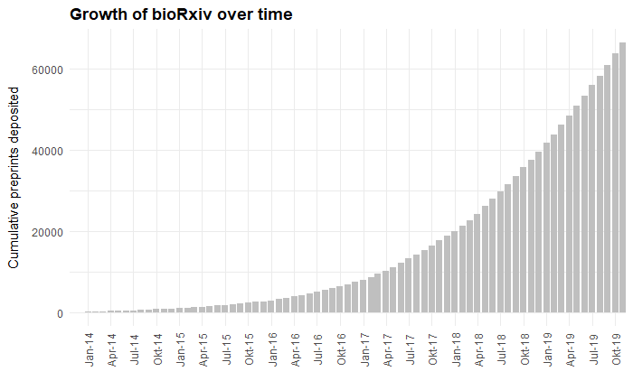
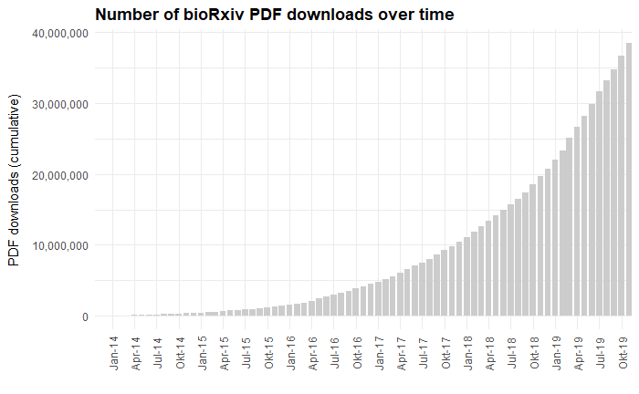

<!-- README.md is generated from README.Rmd. Please edit that file -->
biorrxiv
========

R client for interacting with the [bioRxiv API](https://api.biorxiv.org)

\*\* This is a (very incomplete) work in progress \*\*

Installation
------------

Install the development version from Github:

``` r
# Install package
install.packages("devtools")
devtools::install_github("nicholasmfraser/biorrxiv")

# Load package
library(biorrxiv)
```

Usage
-----

The main functions in `biorrxiv` loosely conform to the API endpoints outlined in the API documentation ([see here](https://api.biorxiv.org/)).

### Content detail

Retrieve details of either a set of preprints deposited between two dates, or lookup a single preprint by DOI:

``` r
# Get details of preprints deposited between 2018-01-01 and 2018-01-10
# By default, only the first 100 records are returned
biorxiv_content(from = "2018-01-01", to = "2018-01-10")

# Set a limit to return more than 100 records
biorxiv_content(from = "2018-01-01", to = "2018-01-10", limit = 200)

# Or set limit as "*" to return all records
biorxiv_content(from = "2018-01-01", to = "2018-01-10", limit = "*")

# Skip the first 100 records
biorxiv_content(from = "2018-01-01", to = "2018-01-10", limit = 200, skip = 100)

# By default, data is returned in a list. Use the "format" argument to specify
# that data should be returned in "json" format or as a data frame ("df").
biorxiv_content(from = "2018-01-01", to = "2018-01-10", format = "df")

# Lookup a preprint by DOI
biorxiv_content(doi = "10.1101/833400")
```

### Published article detail

Retrieve details of published articles associated with bioRxiv preprints that were published between two dates:

``` r
# Get details of all articles published between 2018-01-01 and 2018-01-10
biorxiv_published(from = "2018-01-01", to = "2018-01-10", limit = "*", format = "df")
```

### Publisher article detail

Retrieve details of articles published by a specific publisher (specified by their doi prefix) between two dates:

``` r
# Get details of all articles published by eLife (prefix = 10.7554) between 2018-01-01 and 2018-01-10
biorxiv_publisher(prefix = "10.7554", from = "2018-01-01", to = "2018-01-10", 
                   limit = "*", format = "df")
```

### Content summary statistics

Retrieve summary statistics for bioRxiv content (e.g. number of preprints deposited):

``` r
# Get summary statistics at a montly level
biorxiv_summary(interval = "m")

# Get summary statistics at a yearly level
biorxiv_summary(interval = "y")
```

### Usage summary statistics

Retrieve summary statistics for usage of bioRxiv content (e.g. number of pdf downloads):

``` r
# Get usage statistics at a montly level
biorxiv_usage(interval = "m")
```

Examples
--------

### Growth of bioRxiv over time

``` r
library(tidyverse)

# Plot the cumulative number of new preprints deposited per month
# Note that month dates are returned in YYYY-MM format - here we convert
# month dates to YYYY-MM-DD format to make plotting easier
biorxiv_summary(interval = "m", format = "df") %>%
  mutate(month = as.Date(paste0(month, "-01", format = "%Y-%m-%d"))) %>%
  ggplot() +
  geom_bar(aes(x = month, y = new_papers_cumulative),
           fill = "#cccccc",
           stat = "identity") +
  labs(x = "",
       y= "New preprints deposited (cumulative)",
       title ="Growth of bioRxiv over time") +
  scale_x_date(date_breaks = "3 months",
               date_minor_breaks = "3 months",
               date_labels = "%b-%y",
               expand = c(0,0)) +
  theme_minimal() +
  theme(
    axis.text.x = element_text(angle = 90, vjust = 0.5),
    axis.title.y = element_text(margin = margin(t = 0, r = 10, b = 0, l = 0)),
    plot.title = element_text(face = "bold")
  )
```



### Number of bioRxiv PDF downloads over time

``` r
library(tidyverse)

# Plot the cumulative number of PDF downloads per month
# Here month dates are returned already in YYYY-MM-DD format
biorxiv_usage(interval = "m", format = "df") %>%
  mutate(month = as.Date(month)) %>%
  ggplot() +
  geom_bar(aes(x = month, y = pdf_cumulative),
           fill = "#cccccc",
           stat = "identity") +
  labs(x = "",
       y= "PDF downloads (cumulative)",
       title ="Number of bioRxiv PDF downloads over time") +
  scale_x_date(date_breaks = "3 months",
               date_minor_breaks = "3 months",
               date_labels = "%b-%y",
               expand = c(0,0)) +
  scale_y_continuous(labels = scales::comma) +
  theme_minimal() +
  theme(
    axis.text.x = element_text(angle = 90, vjust = 0.5),
    axis.title.y = element_text(margin = margin(t = 0, r = 10, b = 0, l = 0)),
    plot.title = element_text(face = "bold")
  )
```



Contributing
------------

Contributors are extremely welcome! Please contribute here directly, or contact me at <nicholasmfraser@gmail.com> for more information.
